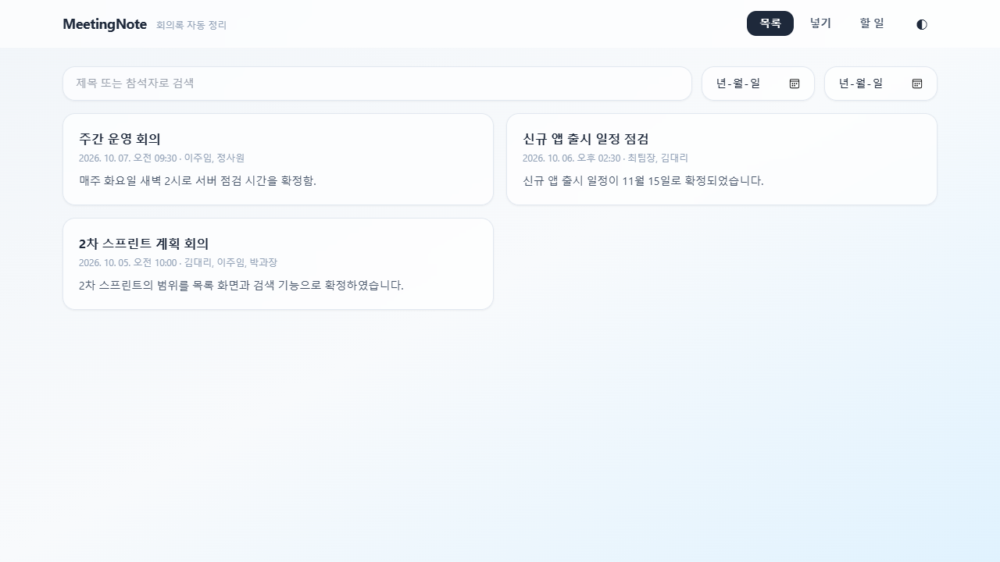
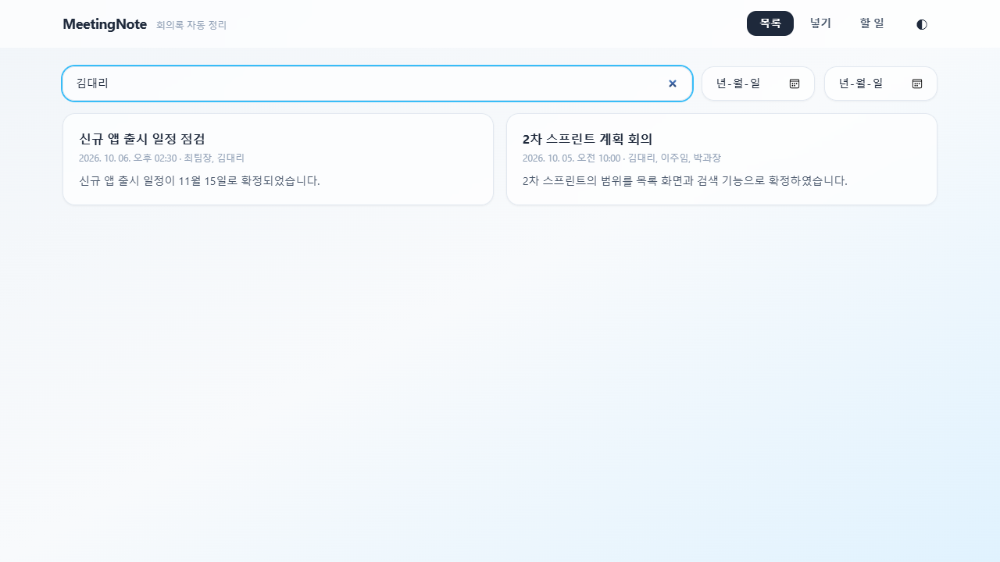
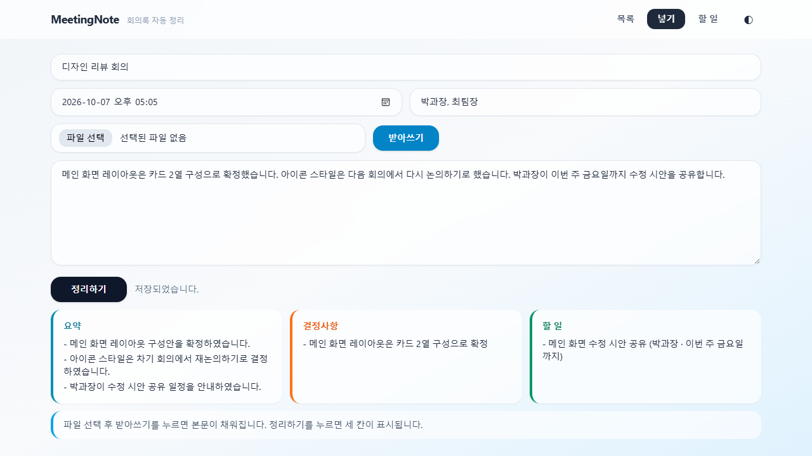
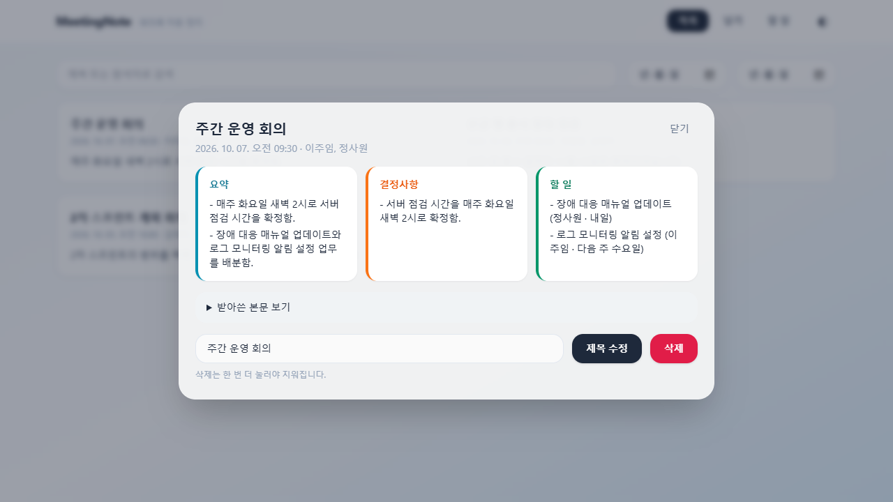
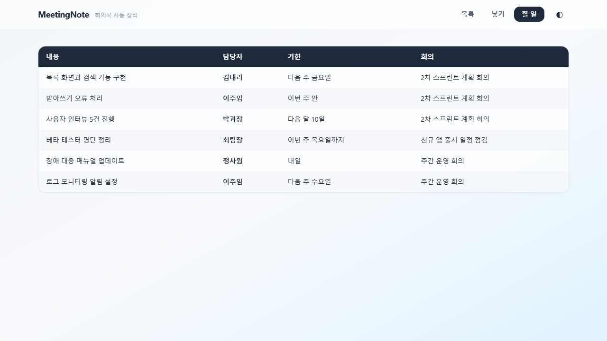
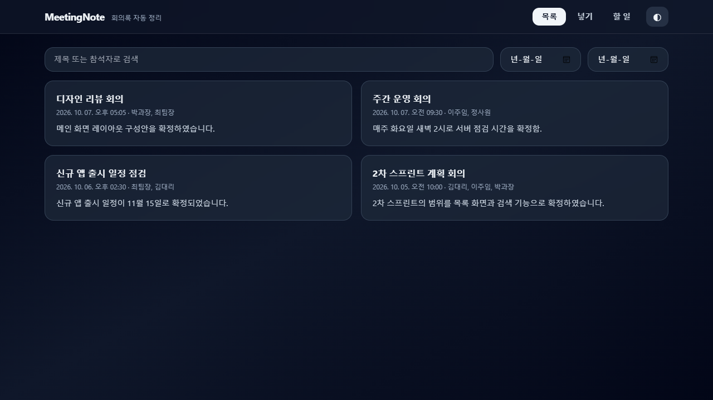
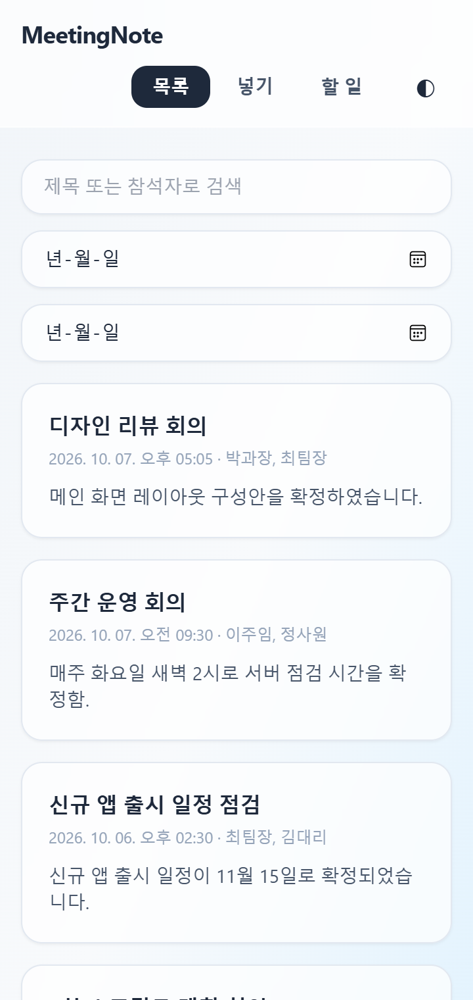
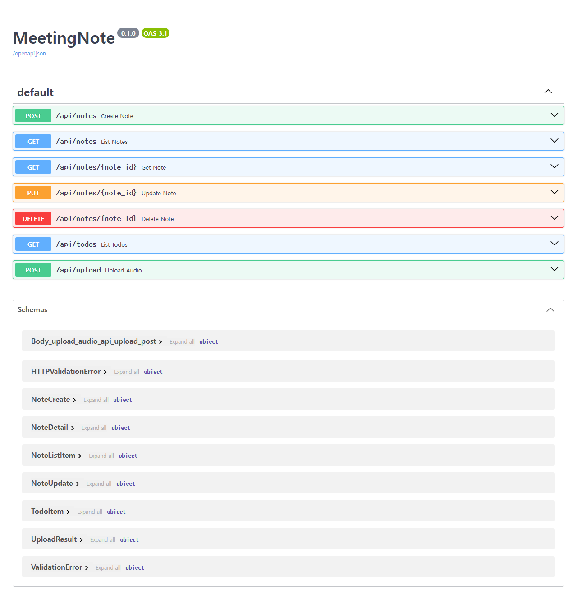

# MeetingNote

> 회의가 끝나면 정리가 끝나 있게. **"그때 뭐라고 했더라"** 가 사라지게.

회의 녹취 파일이나 메모를 올리면 **요약 / 결정사항 / 할 일** 세 갈래로 자동 정리해 저장하는 풀스택 웹 앱입니다.
받아쓰기와 정리는 Gemini API(`gemini-3.1-flash-lite`)가 맡고, 화면은 맥OS 스타일로 만들었습니다.



---

## 한눈에 보기

| 이런 일이 있었다면 | MeetingNote 는 |
|---|---|
| 회의 녹음만 있고 정리할 시간이 없다 | mp3 · wav 를 올리면 **받아쓰기**까지 자동으로 한다 |
| 회의록은 긴데 핵심이 안 보인다 | **요약 · 결정사항 · 할 일** 세 칸으로 나눠 보여 준다 |
| 누가 무엇을 언제까지 하기로 했는지 모르겠다 | 여러 회의의 **할 일만 한 표**로 모아 담당자와 기한을 보여 준다 |
| 지난 회의를 찾을 수 없다 | **제목 · 참석자 · 날짜**로 검색한다 |

---

## 화면 구성

### 1. 목록 — 저장한 회의록을 카드로 보고, 검색으로 찾기

카드에는 제목, 날짜 · 참석자, 요약 첫 줄이 보입니다. 검색칸에 입력할 때마다 바로 다시 조회합니다.
검색은 **제목과 참석자**에 대해 부분 일치로 동작하고(본문은 검색하지 않음), 시작일 · 종료일은 양끝을 포함합니다.



### 2. 넣기 — 녹취 파일 받아쓰기, 메모 붙여넣기, 세 갈래 정리

1. 제목 · 일시 · 참석자를 적습니다.
2. 녹취 파일(mp3, wav, 25MB 이하)을 고르고 **받아쓰기**를 누르면 본문이 채워집니다. 메모를 직접 붙여넣어도 됩니다.
3. **정리하기**를 누르면 저장과 동시에 세 칸이 채워집니다.



> 정리에 실패해도 본문은 그대로 저장됩니다. 이때는 화면에 **구분 실패**가 표시됩니다.

### 3. 상세 — 카드를 누르면 뜨는 가운데 창

세 갈래 결과를 한눈에 보고, 받아쓴 원문은 접어 두었다가 펼쳐 볼 수 있습니다.
제목을 고치거나 삭제할 수 있고, **삭제는 한 번 더 눌러야** 지워집니다. 바깥 어두운 영역을 누르면 닫힙니다.



### 4. 할 일 — 여러 회의의 할 일만 모은 표

담당자, 기한, 어느 회의에서 나온 일인지를 한 표로 봅니다. 회의 날짜가 오래된 순으로 정렬됩니다.
담당자가 드러나지 않은 일은 `미정`으로 표시되고, 기한은 회의에서 말한 그대로("다음 주 금요일") 보여 줍니다.



### 라이트 / 다크 테마, 모바일 반응형

헤더의 ◐ 버튼으로 테마를 바꿉니다. 선택은 브라우저(`localStorage`)에 저장되고, 처음 접속하면 시스템 설정을 따릅니다.
화면은 360px 폭에서도 깨지지 않습니다.

| 다크 테마 | 모바일 (360px) |
|---|---|
|  |  |

---

## 세 갈래는 이렇게 나눕니다

Gemini 에게 아래 기준을 그대로 전달합니다.

| 갈래 | 기준 |
|---|---|
| **요약** | 회의 전체를 3~5줄로. 새로운 사실을 지어내지 않는다 |
| **결정사항** | 「하기로 했다 / 확정 / 승인」 처럼 합의가 끝난 것만. 논의만 하고 정하지 않은 것은 넣지 않는다 |
| **할 일** | 담당자와 기한이 드러난 것만. 담당자가 없으면 `미정` |
| (버림) | 셋 중 어디에도 들어가지 않는 잡담 |

할 일은 한 줄에 하나씩 `내용 | 담당자 | 기한` 형식으로 저장합니다. 기한은 날짜로 바꾸지 않고 말한 그대로 둡니다.

---

## 기술 스택

| 영역 | 사용 기술 |
|---|---|
| 백엔드 `backend/` | FastAPI, Python 3.11 이상, SQLite (SQLAlchemy ORM) |
| 프론트 `frontend/` | Vanilla JS + Tailwind CDN (`index.html`, `app.js` 2개 파일) |
| 받아쓰기 · 정리 | Gemini API (`gemini-3.1-flash-lite`, `google-genai`) |
| 테스트 | pytest, httpx |

프론트는 별도 서버 없이 **백엔드가 같은 오리진에서 함께 제공**합니다. `file://` 로 직접 열지 않습니다.

---

## 실행 방법

### 1. 준비

```bash
# 프로젝트 루트에서
python -m venv .venv
.venv\Scripts\activate            # macOS/Linux: source .venv/bin/activate
pip install -r backend/requirements.txt
```

### 2. `.env` 만들기

프로젝트 루트에 `.env` 파일을 만들고 키를 입력합니다. 이 파일은 `.gitignore` 에 들어 있어 저장소에 올라가지 않습니다.

```
GEMINI_API_KEY=여기에_키_입력
GEMINI_MODEL=gemini-3.1-flash-lite
```

### 3. 서버 실행

```bash
cd backend
uvicorn main:app --port 8000
```

| 주소 | 내용 |
|---|---|
| http://localhost:8000/ | 앱 |
| http://localhost:8000/docs | API 문서 (Swagger) |

---

## API

모든 경로는 `/api/` 로 시작합니다.

| 메서드 | 경로 | 성공 | 설명 |
|---|---|---|---|
| POST | `/api/notes` | 201 | 저장하며 세 갈래 구분까지 수행 |
| GET | `/api/notes` | 200 | 목록 (`q` 제목·참석자 검색, `from`·`to` 날짜). `body` 제외 |
| GET | `/api/notes/{id}` | 200 | 단건. `body` 포함 |
| PUT | `/api/notes/{id}` | 200 | 수정 (전체 교체) |
| DELETE | `/api/notes/{id}` | 204 | 삭제 |
| GET | `/api/todos` | 200 | 할 일만 모아 보기 (`what` / `who` / `when` / `note_id` / `note_title`) |
| POST | `/api/upload` | 200 | 녹취 파일을 받아 본문 텍스트로 반환 |

오류 코드는 다음과 같습니다.

| 코드 | 의미 |
|---|---|
| 400 | `title` / `met_at` / `body` 누락 또는 형식 오류 |
| 404 | 없는 id |
| 413 | 업로드 파일이 25MB 초과 |
| 415 | 업로드 파일이 mp3, wav 가 아님 |
| 422 | 스펙 외 필드 포함 |
| 502 | 받아쓰기 외부 호출 실패 |



회의 시각(`met_at`)은 **UTC 로 저장**합니다. 화면의 `datetime-local` 값은 로컬 시각이므로, 보낼 때 UTC 로 바꾸고 받아서 표시할 때 로컬로 되돌립니다.

---

## 테스트

```bash
cd backend
pytest
```

**21케이스**(MVP 기준 13 + 추가 검증 8)가 모두 통과합니다. 받아쓰기와 세 갈래 구분이 진짜 되는지는 실제로 불러 봐야 알 수 있어서, 성공 경로 테스트는 **실제 Gemini 를 호출**합니다(호출 사이 1초 간격). 실패 경로(구분 실패 시 201, 받아쓰기 실패 시 502)만 실패를 흉내 냅니다.
케이스 목록은 [`docs/05-conventions.md`](docs/05-conventions.md) 의 테스트 매트릭스에 있습니다.

---

## 폴더 구조

```
meetingnote/
├─ CLAUDE.md          # 작업 규칙 (역할 · 기술 스택 · 절대 규칙)
├─ README.md
├─ .env               # 키 (저장소에 올리지 않음)
├─ backend/           # FastAPI + SQLite
│  ├─ main.py         #   API 7개, 오류 처리, 프론트 제공
│  ├─ models.py       #   Meeting 모델
│  ├─ schemas.py      #   요청 · 응답 스키마와 검증
│  ├─ gemini_service.py  # 받아쓰기, 세 갈래 구분
│  ├─ config.py · database.py
│  └─ tests/          #   pytest
├─ frontend/          # index.html + app.js
└─ docs/              # 설계 문서 (아래 참고)
```

## 문서

작업 전에 `docs/` 의 6개 파일을 아래 순서로 읽습니다. 문서마다 한 가지 질문에만 답하도록 나눴습니다(관심사 분리).

| 순서 | 파일 | 답하는 질문 |
|---|---|---|
| 0 | [`00-overview.md`](docs/00-overview.md) | 문서가 어떻게 구성되어 있나 |
| 1 | [`01-product.md`](docs/01-product.md) | 무엇을, 왜 만드나 |
| 2 | [`02-specs.md`](docs/02-specs.md) | 어떻게 동작해야 하나 |
| 3 | [`03-design.md`](docs/03-design.md) | 어떻게 짜나 (선택과 근거) |
| 4 | [`04-tasks.md`](docs/04-tasks.md) | 무엇을 할 것인가 |
| 5 | [`05-conventions.md`](docs/05-conventions.md) | 어떤 규칙으로 쓰나 |

## 범위

**MVP 에 포함**: 녹취 업로드 · 메모 붙여넣기, 세 갈래 구분, 회의록 CRUD, 검색, 할 일 모아 보기, 라이트/다크 테마, 360px 반응형.

**확장 단계**: JWT 로그인, 팀 공유, 화자 구분, 알림.

**범위 외**: 실시간 녹음, 외부 캘린더 연동, 메일 발송, 25MB 넘는 파일의 분할 업로드.
